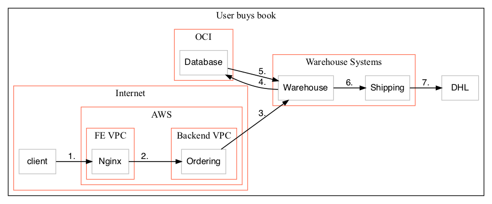
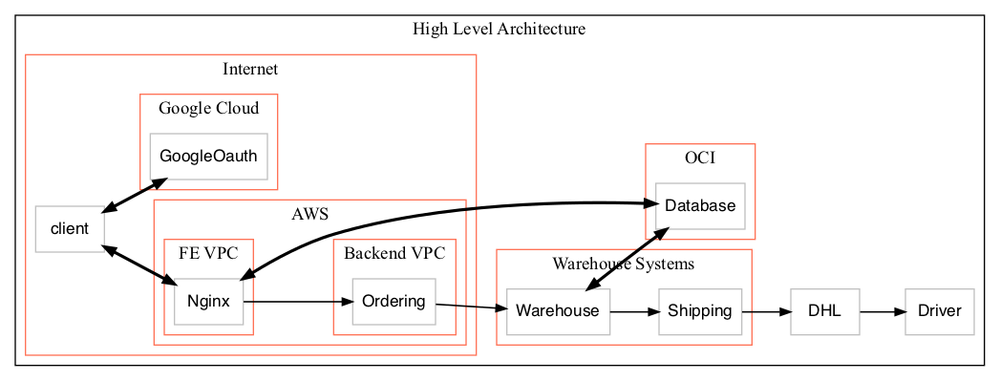

## User lists books

User lists books
## User login

User login
## User buys book

User buys book
## High Level Architecture

High Level Architecture
## User lists books

| From | To | Data |
| ---- | -- | ---- |
| client | Nginx | GET /books |
| Nginx | Database | All book titles |
| Database | Nginx | Titles |
| Nginx | client | Books |
## User login

| From | To | Data |
| ---- | -- | ---- |
| client | Nginx | GET /login |
| Nginx | client | 302 Google Oauth |
| client | GoogleOauth | Request Token |
| GoogleOauth | client | Token |
| client | Nginx | Token |
| Nginx | client | Cookie |
## User buys book

| From | To | Data |
| ---- | -- | ---- |
| client | Nginx | POST /buy?bookid=3 |
| Nginx | Ordering | User X buys book3 |
| Ordering | Warehouse | Start picking book3 for customer X |
| Warehouse | Database | Get address for customer X |
| Database | Warehouse | Customer address |
| Warehouse | Shipping | Prepare invoice for shipping to address |
| Shipping | DHL | Ship Order |
